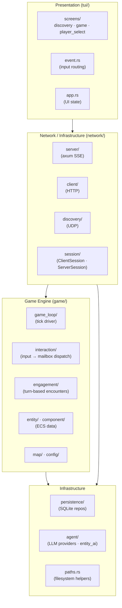

# Architecture

- **Game Engine** (`game/`) — domain layer: tick loop, engagement system, ECS entities/components, interaction dispatch into entity mailboxes, map and config loading.
- **Interaction** (`game/interaction/`) — routes player input (movement, look, help, conversation) from mailboxes into game world effects. First-class submodule of `game/`, not a game_loop implementation detail.
- **Engagement** (`game/engagement/`) — turn-based encounter system; the ECS "system" layer. Handles conversation turns, action resolution, and timeout logic.
- **TUI** (`tui/`) — ratatui terminal UI. Screens (`screens/`) are the major UI modes: discovery, player_select, game. Event handling in `event.rs` routes keyboard and network events to the active screen.
- **Network** (`network/`) — axum SSE server and HTTP client. Session management (`network/session/`) lives here as infrastructure alongside the server/client/discovery transports.
- **Persistence** (`persistence/`) — SQLite repository layer via sqlx. Cross-cutting; used by both the server and the game loop.
- **Agent** (`agent/`) — LLM provider integrations (Anthropic, OpenAI, Gemini, Cohere, Ollama, xAI) and `entity_ai` types that track per-entity conversation state.
- **Paths** (`paths.rs`) — filesystem helpers for session directories, database URLs, and config discovery.

# Module Map

| Module | Layer | Responsibility |
|---|---|---|
| `game/` | Domain | ECS tick loop, entities, components, map |
| `game/interaction/` | Domain | Routes player input from mailboxes into world effects |
| `game/engagement/` | Domain | Turn-based encounter and conversation system |
| `network/` | Infrastructure | axum SSE server, HTTP client, UDP discovery |
| `network/session/` | Infrastructure | ClientSession and ServerSession lifecycle |
| `tui/` | Presentation | ratatui terminal UI |
| `tui/screens/` | Presentation | Major UI modes: discovery, player_select, game |
| `persistence/` | Infrastructure | SQLite repositories via sqlx |
| `agent/` | Infrastructure | LLM provider integrations + entity AI state types |
| `paths.rs` | Infrastructure | Filesystem path helpers (session dirs, DB URL) |
| `cli.rs` | Entry | clap CLI argument parsing |
| `logging.rs` | Cross-cutting | tracing subscriber setup |

# Relevant Files

| Path | Role |
|---|---|
| `src/game/game_loop.rs` | Tick driver; calls interaction, engagement, effects, attributes |
| `src/game/interaction.rs` | Interaction dispatcher; owns movement, look, help, conversation handlers |
| `src/game/engagement/` | Turn-based encounter types and processing |
| `src/tui/screens/` | Major UI screens: discovery, game, player_select |
| `src/tui/event.rs` | Keyboard and network event routing |
| `src/network/server/` | axum SSE server, handlers, message relay |
| `src/network/session/` | ClientSession and ServerSession persistence |
| `src/persistence/` | SQLite repository functions |
| `src/agent/` | LLM providers and entity AI state types |
| `src/paths.rs` | Filesystem path helpers |
