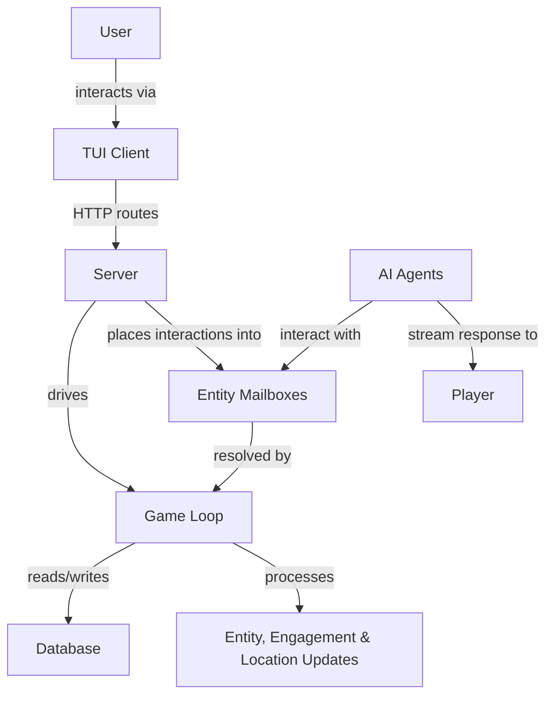

# Architecture

- Users interact with a TUI client.
- The server exposes routes for all major functionality to the client.
- Behind the server is the game loop.
- Within the game loop, game state is fetched from the DB, then entity, engagement, and location updates are processed.
- The server can place interactions into entity mailboxes, which are resolved as part of the game loop.
- AI agents interact with mailboxes.
    - They can stream responses into a mailbox and directly to the player.