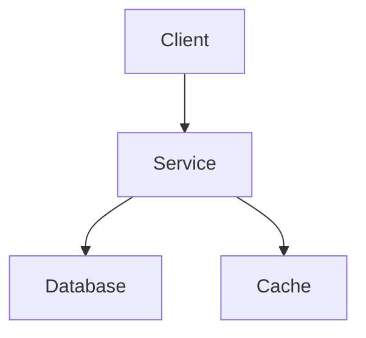

# Overview

- Here we should have a few bullets describing the system.
- We should keep it brief.
- We should always start with diagrams at the top 

# Relevant Files

Here we should list relevant files in a table.

# Links

- Link to other pertinent documents.