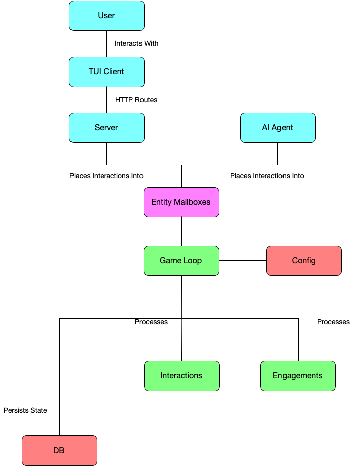

# Architecture

The following is a high level overview of the mudroom engine architecture:

- The user interacts with the game via a TUI client.
- Interactions are sent to the server via HTTP requests
- The server receives these requests, parses the interactions and places them in the appropriate entity's mailbox.
- The game loop, which running at a set interval, pull these interactions out of the mailboxes and routes to the appropriate processing layer.
- Simple interactions may be processed directly in the game loop. These will typically be interactions such as "pick up item", which can be completed in a single syncronous transaction.
- More complex interactions will initiate an engagement. For example, we may have an interation which is "Start Battle with Faction X". This will then initiate a battle engagement.
- An enagement will typically have it's own turn based loop (which exists within the timing of the overall gaming loop). Enagements have their own logic and will continue to be actively serviced by the game loop until they complete.
- As interactions and engagements are processed, the game loop emits player messages via the messaging system. These are broadcast over SSE to the TUI client and cover everything from simple text responses to streaming AI chunks and battle state updates.
- The game loop, upon completion of a tick will then persist ephermeral state to thread safe memory storage and persistent state to a local database.
- The behavior of the game loop, and the entities which exist within it, are defined by human/agent editable configuration files.
